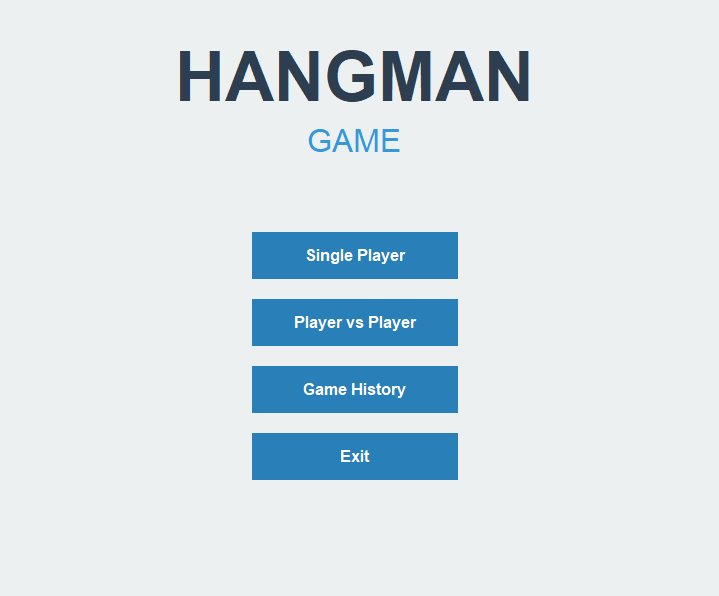
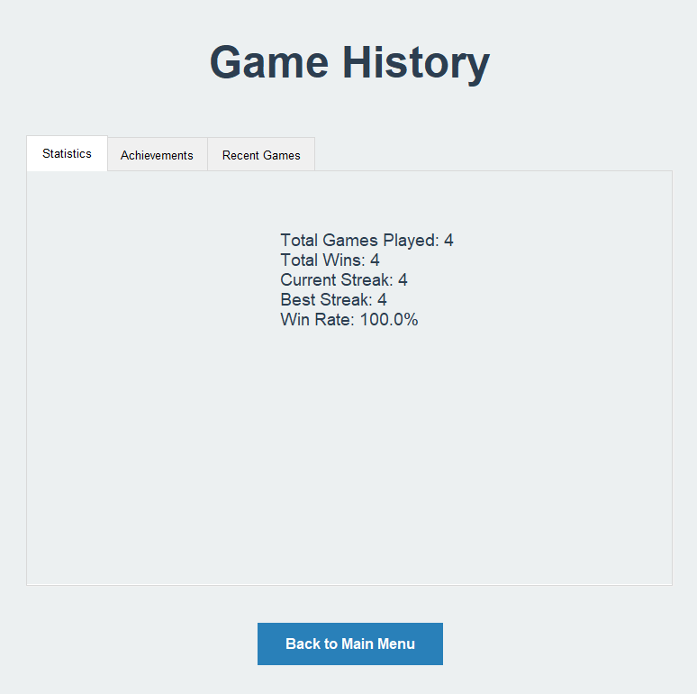
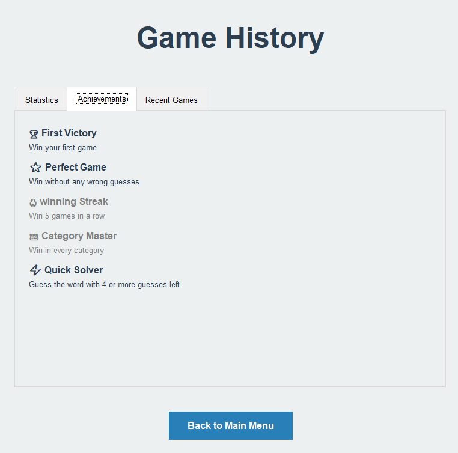
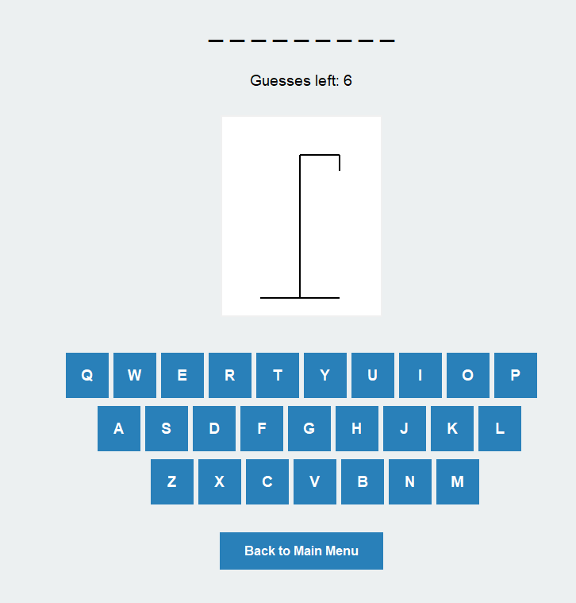

# Hangman Game

A fun and interactive Hangman game built using Python's Tkinter library. This game allows both single-player and player-versus-player (PvP) gameplay. The game includes various features such as achievements, a dynamic word category selection, and a history tracking system that stores your game stats.

## Features

- **Single Player Mode**: Play solo and guess words from various categories such as Movies, Animals, Countries, Sports, and Food.
- **Player vs. Player Mode**: Players take turns entering words for the other player to guess.
- **Categories**: Choose from different categories (Movies, Animals, etc.) to make the game more engaging.
- **Achievements**: Track your achievements, including the first win, perfect games, winning streaks, and more.
- **Game History**: Keep track of your game history, including the number of games played, your win/loss record, and your streaks.
- **Graphical Hangman**: Visual representation of the hangman with each incorrect guess.
- **Custom Word Input (PvP)**: In player-versus-player mode, players can input their own word for their opponent to guess.

## Requirements

To run the game, you need Python 3.x installed along with the `Tkinter` library, which is included by default in most Python installations.

## Installation

1. Clone this repository or download the script:
   ```bash
   git clone https://github.com/youssefghgg/hangman.git
   ```

2. Navigate to the project directory:
   ```bash
   cd hangman
   ```

3. Run the script:
   ```bash
   python hangman.py
   ```

4. Enjoy the game!

## How to Play

### Single Player Mode:
1. Start the game and select a category (Movies, Animals, etc.).
2. Guess letters to try and figure out the hidden word.
3. You have 6 incorrect guesses before the game is lost.
4. Once you guess all the letters or run out of attempts, the game will show the result and your statistics will be updated.

### Player vs. Player Mode:
1. Player 1 enters a word for Player 2 to guess.
2. Player 2 guesses one letter at a time.
3. The game ends when Player 2 guesses the word or runs out of attempts.
4. The results are shown at the end of the game, and Player 1 can enter a new word.

## Achievements

- **First Victory (🏆)**: Win your first game.
- **Perfect Game (⭐)**: Win without any wrong guesses.
- **Winning Streak (🔥)**: Win 5 games in a row.
- **Category Master (👑)**: Win in every category.
- **Quick Solver (⚡)**: Guess the word with 4 or more guesses left.

## Game Stats

The game tracks your progress in the following areas:

- **Total Games Played**
- **Total Wins**
- **Current Streak**: Your current streak of consecutive wins.
- **Best Streak**: Your best streak of consecutive wins.
- **Game History**: The last 10 games you played, including the word, category, and number of guesses remaining.

## License

This project is licensed under the MIT License - see the LICENSE file for details.

## Acknowledgements

- Python and Tkinter for the game development environment.
- The word categories are custom and can be expanded.

## Screenshots
#### menu

#### pvp screen

#### game history

#### Achievements

#### recent games

#### sellction screen

#### game screen
